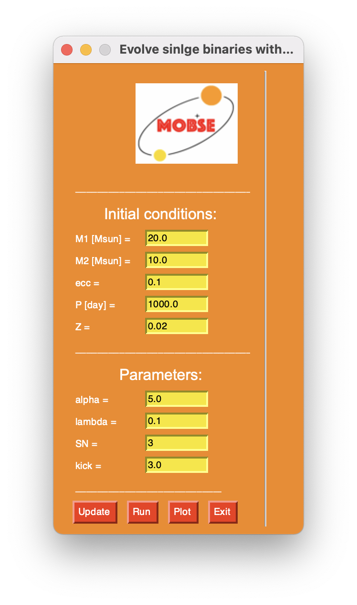
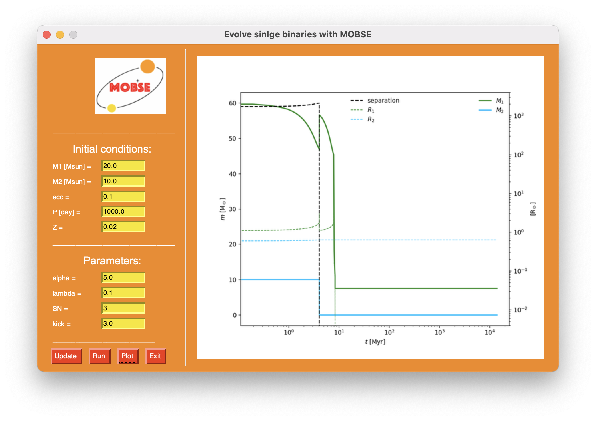

```                                                                                                 
           _/  _/   
╔═╗╦ ╦╦   _/  _/   ╔╦╗╔═╗╔╗ ╔═╗╔═╗
║ ╦║ ║║  _/_/_/_/  ║║║║ ║╠╩╗╚═╗║╣   
╚═╝╚═╝╩     _/     ╩ ╩╚═╝╚═╝╚═╝╚═╝
           _/
```
[](https://github.com/GiacobboNicola/gui4mobse/blob/main/LICENSE)
[](https://github.com/GiacobboNicola/gui4mobse/releases/tag/v0.1)
[](https://gitlab.com/mobse/source-code/-/releases/v1.0)

This is a simple Graphic Interface that allows to use [MOBSE](https://mobse-webpage.netlify.app/) for evolving single binary systems.

## Usage
First, you need to download the source code of *MOBSE* by typing `python download.py`.

After that, you simply have to run the command `python gui4mobse.py`. A window like the one in shown in [fig.1](pics/gui_entri.png) will open. 



To build you preferred system you can change the various *Initial conditions* and *Parameters*. Once you are happy with the values, don't forget to press the `Update` button to save them.  
Now you are ready to use `Run`. It will compile and run *MOBSE* to evolve your system. 

After execution you will find the evolution saved in two txt files called `mobse_long.out` and `mobse_label.out` (stored in `output`). With `Plot`, you can visualize the evolution of some important properties (i.e. masses, radii and orbital separation) as shown in [fig.2](pics/gui.png)).



## Have fun!
